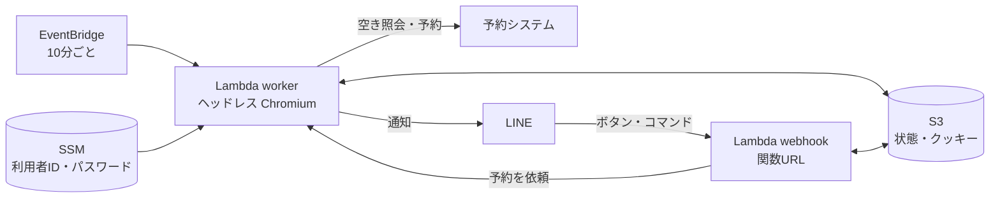

# fukuoka-gym-reservation

[福岡市公共施設案内・予約システム](https://www3.11489.jp/fukuoka/user/Home)で、体育館の**個人利用**の枠（バドミントン・卓球など）を定期的に見張り、空きが出たら LINE に通知します。通知の「予約する」ボタンや自動予約で、そのまま予約もできます。

- 空き確認はログイン不要の「空き照会」画面を読むだけです
- 予約にはログインが必要です。利用者ID・パスワードは自分の AWS アカウントの SSM パラメータストア（SecureString）に暗号化して置き、ログインが切れたときだけ Lambda が使います（reCAPTCHA は突破しません）
- AWS Lambda で動かすので PC を起動しておく必要はなく、費用はほぼ無料枠に収まります

## 構成



| ファイル | 役割 |
| --- | --- |
| `src/site.ts` | 予約システムの画面操作（施設選択 → 施設別空き状況 → 時間帯別空き状況） |
| `src/check.ts` | 指定した施設・期間の空き枠を集める |
| `src/book.ts` | 1枠を予約する（申込内容入力 → 申込） |
| `src/app.ts` | 空き確認・通知・自動予約・LINE の操作の本体 |
| `src/line.ts` | LINE Messaging API とメッセージの見た目（空き一覧・予約の確認・設定・条件） |
| `src/store.ts` | 状態とクッキーの保存（S3、PC では `.data/`） |
| `src/credentials.ts` | 利用者ID・パスワードの読み込み（SSM パラメータストア） |
| `src/lambda.ts` | Lambda の入口（`worker` / `webhook`） |
| `src/watch.ts` | PC で動かす場合の定期実行 |
| `infra/app.ts` | AWS の構成（CDK） |
| `scripts/richmenu.ts` | LINE のリッチメニューを作る |

## LINE でできること

トーク画面の下のメニュー（リッチメニュー）から操作します。

| メニュー | できること |
| --- | --- |
| 空き状況 | いま条件に合う空き枠と、確認・自動予約の状態 |
| 今すぐ確認 | 10分を待たずにその場で空きを調べ直す |
| 予約一覧 | このシステムで取った、これからの予約 |
| 条件 | 探す曜日・時間帯（土日＋平日夜／土日だけ／平日の夜／いつでも）と人数 |
| 設定 | 空き確認の停止・再開、自動予約のオン・オフ、お試し・本番の切り替え |
| ヘルプ | 使い方 |

空き通知の **「予約する」** を押すと確認が出て、「予約する」でもう一度押すと予約します（初期値はお試しモードで、最後の「申込」は押しません）。

## セットアップ

Node.js 24 以上、AWS CLI v2、LINE 公式アカウントが必要です。

```bash
npm install
npx playwright install chromium   # PC で動かす・ログインするときに使う
cp .env.example .env
```

### LINE の準備（Messaging API）

LINE Notify は 2025年3月に終了したため、自分専用の LINE 公式アカウントから送ります（無料プランで月200通まで。返信は数えません）。

1. [LINE公式アカウント](https://entry.line.biz/form/entry/unverified)を作り、Official Account Manager の「設定 → Messaging API」で利用を開始する
2. [LINE Developers](https://developers.line.biz/console/) のチャネルで
   - 「チャネル基本設定」の**チャネルシークレット** → `.env` の `LINE_CHANNEL_SECRET`
   - 「Messaging API設定」の**チャネルアクセストークン（長期）** → `.env` の `LINE_CHANNEL_ACCESS_TOKEN`
3. 「Messaging API設定」の QR コードから、その公式アカウントを友だち追加する
4. `npm run notify:test` でテスト通知が届くか確かめる

### AWS にデプロイ

```bash
aws login
npm run bootstrap   # 初回だけ
npm run deploy
```

出力された値を設定します。最後にリッチメニューを作ります（メニューを変えたときも実行します）。

```bash
npm run richmenu
```


- `FukuokaGymReservation.StateBucket` → `.env` の `STATE_BUCKET`
- `FukuokaGymReservation.WebhookUrl` → LINE Developers の「Messaging API設定 → Webhook URL」に入れて「Webhookの利用」をオン。Official Account Manager の「応答設定」で応答メッセージはオフ

`.env` の LINE の値は Lambda の環境変数として渡されるので、変えたら `npm run deploy` し直してください。

### 予約システムへのログイン

予約するには、予約システムの[利用者登録](https://www.city.fukuoka.lg.jp/soki/system/shisei/koukyousisetsu-yoyaku_riyoutouroku_3.html)が必要です（オンライン申請で本人確認後、施設の承認まで2〜4週間）。登録が済んだら、発行された利用者ID（メールアドレスではなく英数字の ID）とパスワードを登録します。

```bash
npm run set-credentials
```

SSM パラメータストアの `/fukuoka-gym-reservation/user-id` と `/fukuoka-gym-reservation/password` に SecureString で保存され、読めるのは worker Lambda だけです。予約のときにログインが切れていれば、これで自動的にログインし直します。パスワードを変えたらもう一度実行してください。

自動ログインで reCAPTCHA が出た場合などは LINE で知らせて自動予約だけ止まります。そのときは PC で `npm run login` を実行し、開いたブラウザで自分でログインすると、クッキーが S3 に保存されて再開します。

## 設定（config.json）

| 項目 | 意味 |
| --- | --- |
| `sport` | 種目。時間帯別空き状況でこの文字列を含む行を探す（例: `バドミントン`、`卓球`） |
| `facilities` | 見る施設。予約システムの施設選択画面の名前そのまま（例: `市民体育館（個人利用）`） |
| `dayRow` | 施設別空き状況で見る行。バドミントンは `競技場` |
| `weeksAhead` | 今日から何週間先まで見るか |
| `wants` | 希望条件。`weekdays`（日〜土）、`from`（開始がこの時刻以降）、`to`（終了がこの時刻まで）。どれか1つに合えば対象 |
| `intervalMinutes` | 確認の間隔（分） |
| `quietHours` | 確認しない時間帯 `[開始時, 終了時)`（日本時間） |
| `autoBook.enabled` | 空きが出たら自動で予約するか（LINE の `自動予約オン/オフ` で上書き） |
| `autoBook.dryRun` | `true` の間は最後の「申込」を押さない（LINE の `お試しモード/本番モード` で上書き） |
| `autoBook.maxPerMonth` | 利用月ごとの自動予約の上限 |
| `autoBook.minDaysAhead` | 何日先以降の枠だけ自動予約するか（1 = 明日以降） |
| `autoBook.people` | 利用人数 |
| `autoBook.purpose` | 申込内容入力の利用目的。省略すると `sport` と同じ |

`config.json` を変えたら `npm run deploy` で反映します。

## PC だけで動かす

AWS を使わずに PC で動かすこともできます（PC を起動している間だけ確認します。LINE のボタンやコマンドは使えません）。

```bash
npm run check   # 1回だけ確認
npm run watch   # ずっと動かす
```

## 注意

- 自動予約は、1回の確認で1件まで、同じ日に2枠は取らない、月の上限つきです
- 当日キャンセルは翌月1か月間の新規予約停止のペナルティがあります（利用日前日19時まではシステムから取消可）
- キャンセル前提の予約や複数アカウントでの予約は、予約システムの「[不適切な利用](https://www.city.fukuoka.lg.jp/soki/system/shisei/documents/futekiseturiyoiu.pdf)」として利用停止の対象です
- 申込内容入力の画面操作は、市の操作マニュアルをもとに作っています。最初はお試しモードで、スクリーンショット（`screenshots/`）を確認してください
