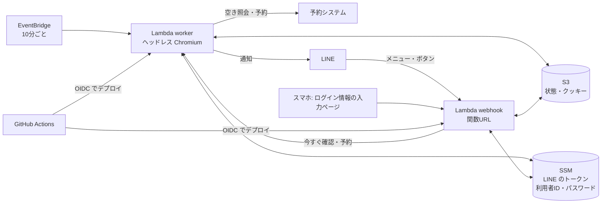

# fukuoka-gym-reservation

[福岡市公共施設案内・予約システム](https://www3.11489.jp/fukuoka/user/Home)で、体育館の**個人利用**の枠（バドミントン・卓球など）を見張り、空きが出たら LINE に通知して、LINE のボタンからそのまま予約できるようにします。

- **使うのはスマホの LINE だけ**です。PC は要りません
- 空き確認・予約は AWS Lambda で動きます（費用はほぼ無料枠）
- 改修は GitHub の `main` に push すると GitHub Actions が自動でデプロイします

## LINE での使い方

トーク画面の下のメニューから操作します。

| メニュー | できること |
| --- | --- |
| 空き状況 | いま条件に合う空き枠と、今の状態 |
| 今すぐ確認 | 10分を待たずにその場で空きを調べ直す |
| 予約一覧 | このシステムで取った、これからの予約 |
| 条件 | 探す曜日・時間帯（土日＋平日夜／土日だけ／平日の夜／いつでも）、人数、体育館（9館から複数） |
| 設定 | 空き確認の停止・再開、自動予約のオン・オフ、お試し・本番、**ログイン情報の登録** |
| ヘルプ | 使い方 |

- 空き通知の **「予約する」** → 確認 → 「予約する」で予約します
- 予約するには、最初に「設定」→「ログイン情報」で予約システムの利用者IDとパスワードを登録します。数分だけ・1回だけ使える入力ページが開き、パスワードは LINE のトークを通らずに AWS に暗号化して保存されます。登録するとすぐにログインできるか確かめて、結果を LINE に送ります
- 初期値は **お試しモード** です（最後の「申込」を押さずに止まります）。お試しでうまく動いたら「設定」で本番にします

## 構成



| ファイル | 役割 |
| --- | --- |
| `src/site.ts` | 予約システムの画面操作（施設選択 → 施設別空き状況 → 時間帯別空き状況） |
| `src/check.ts` | 指定した施設・期間の空き枠を集める |
| `src/book.ts` | 1枠を予約する（ログイン → 申込内容入力 → 申込）。ログインの確認 |
| `src/app.ts` | 空き確認・通知・自動予約・LINE の操作の本体 |
| `src/line.ts` | LINE Messaging API とメッセージの見た目 |
| `src/web.ts` | ログイン情報の入力ページ（1回限りのリンク） |
| `src/secrets.ts` | SSM パラメータストアの秘密情報 |
| `src/store.ts` | 状態とクッキーの保存（S3） |
| `src/lambda.ts` | Lambda の入口（`worker` / `webhook`） |
| `infra/app.ts` | AWS の構成（CDK）。GitHub Actions 用のデプロイロールも含む |
| `scripts/richmenu.ts` | LINE のリッチメニューを作る |
| `.github/workflows/deploy.yml` | `main` への push でデプロイ |

秘密情報はすべて SSM パラメータストアの SecureString（無料）にあり、コードや GitHub には置きません。

| パラメータ | 中身 | 登録のしかた |
| --- | --- | --- |
| `/fukuoka-gym-reservation/line-channel-access-token` | LINE のチャネルアクセストークン（長期） | 初回だけ手で |
| `/fukuoka-gym-reservation/line-channel-secret` | LINE のチャネルシークレット | 初回だけ手で |
| `/fukuoka-gym-reservation/user-id` / `password` | 予約システムの利用者ID・パスワード | LINE の「設定」→「ログイン情報」 |

## 改修するとき

`main` に push すると GitHub Actions が型チェックしてデプロイします。リッチメニューの画像（`assets/richmenu.png`）や `scripts/richmenu.ts` を変えたときは、メニューも作り直します。手動で動かすときは GitHub の Actions 画面から `deploy` を実行します（「リッチメニューも作り直す」を選べます）。

`config.json` の主な項目（LINE で変えられないもの）:

| 項目 | 意味 |
| --- | --- |
| `sport` | 種目。時間帯別空き状況でこの文字列を含む行を探す（例: `バドミントン`、`卓球`） |
| `facilities` | LINE の「条件」で選べる施設。順番を変えると古い通知のボタンが別の施設を指すので、足すときは末尾に |
| `defaultFacilities` | 最初に選ばれている施設 |
| `dayRow` | 施設別空き状況で見る行。バドミントンは `競技場` |
| `weeksAhead` | 今日から何週間先まで見るか |
| `wants` | 「土日＋平日夜」の中身。`weekdays`・`from`・`to` |
| `intervalMinutes` / `quietHours` | 確認の間隔（分）と、確認しない時間帯 `[開始時, 終了時)`（日本時間） |
| `autoBook.maxPerMonth` / `minDaysAhead` | 自動予約の月の上限と、何日先以降の枠だけ取るか |
| `autoBook.purpose` | 申込内容入力の利用目的。省略すると `sport` と同じ |

## はじめて作るとき

PC がなくても、AWS コンソールの **CloudShell**（ブラウザで使えるターミナル）でできます。

1. LINE 公式アカウントを作り、Messaging API を有効にする（[LINE Developers](https://developers.line.biz/console/)）
2. CloudShell でトークンとシークレットを登録する

   ```bash
   aws ssm put-parameter --region ap-northeast-1 --type SecureString --name /fukuoka-gym-reservation/line-channel-access-token --value '...'
   aws ssm put-parameter --region ap-northeast-1 --type SecureString --name /fukuoka-gym-reservation/line-channel-secret --value '...'
   ```

3. CloudShell で初回のデプロイ（GitHub Actions 用のロールもここで作られます）

   ```bash
   git clone https://github.com/MiyazakiSora1234/fukuoka-gym-reservation.git && cd fukuoka-gym-reservation
   npm ci && npx cdk bootstrap && npm run deploy && npm run richmenu
   ```

4. 出力された `WebhookUrl` を LINE Developers の「Messaging API設定 → Webhook URL」に入れ、「Webhookの利用」をオン。Official Account Manager の「応答設定」で応答メッセージはオフ
5. スマホで公式アカウントを友だち追加して、「設定」→「ログイン情報」を登録する（予約システムの[利用者登録](https://www.city.fukuoka.lg.jp/soki/system/shisei/koukyousisetsu-yoyaku_riyoutouroku_3.html)が済んでから）

## 注意

- 自動予約は、1回の確認で1件まで、同じ日に2枠は取らない、月の上限つきです
- 当日キャンセルは翌月1か月間の新規予約停止のペナルティがあります（利用日前日19時まではシステムから取消可）
- キャンセル前提の予約や複数アカウントでの予約は、予約システムの「[不適切な利用](https://www.city.fukuoka.lg.jp/soki/system/shisei/documents/futekiseturiyoiu.pdf)」として利用停止の対象です
- ログイン画面には条件つきで reCAPTCHA が出ます。出た場合は自動で突破せず、LINE で知らせます
- 申込内容入力の画面操作は、市の操作マニュアルをもとに作っています。最初はお試しモードで確認してください
